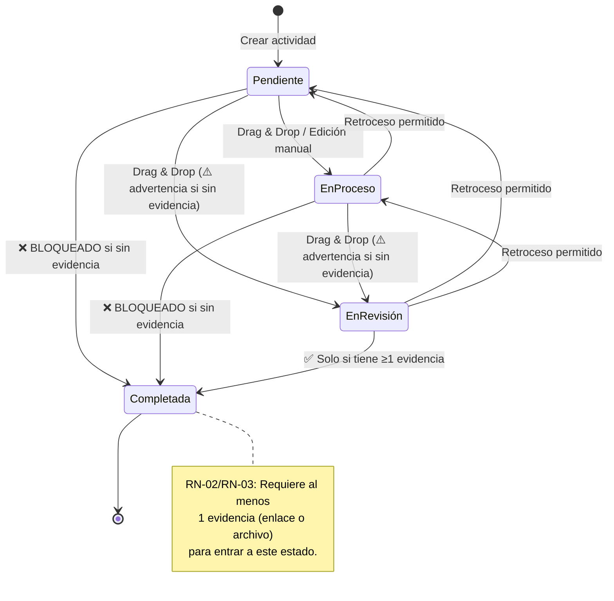

# Documento 1 — Catálogo de Estados
## SchoolBoard (TaskBoard Académico)

> **Autor**: Dev
> **Proyecto**: SchoolBoard — Sistema de Gestión de Actividades Académicas (Equipo 5)
> **Fuente de verdad**: Código fuente del repositorio `CharlyLP04/SchoolBoard`

---

## 1. Catálogo de Estados (Ciclo de Vida de una Actividad)

### 1.1 Definición Formal de Estados

| ID del Estado | Etiqueta UI | Columna Kanban | Descripción | Color UI |
|---|---|---|---|---|
| `pendiente` | Pendiente | 1ª columna | Actividad registrada pero **no iniciada**. Es el estado por defecto al crear una actividad. | `bg-white/10` · Gris neutro |
| `proceso` | En proceso | 2ª columna | Actividad **en desarrollo activo**. Un miembro del equipo está trabajando en ella. | `bg-lavender/15` · Lavender |
| `revision` | En revisión | 3ª columna | Actividad **terminada en desarrollo** y puesta a consideración para validación de evidencias. | `bg-priority-medium/15` · Amarillo |
| `completada` | Completada | 4ª columna | Actividad **finalizada y validada**. Requiere obligatoriamente al menos 1 evidencia adjunta. | `bg-priority-low/15` · Verde |

> [!IMPORTANT]
> **Fuente en código**: Los estados están definidos como columnas Kanban en [`TaskContext.jsx`](file:///c:/Users/col28/OneDrive/Desktop/SchoolBoard/src/context/TaskContext.jsx#L17-L22) y como labels del servidor en [`server/index.js`](file:///c:/Users/col28/OneDrive/Desktop/SchoolBoard/server/index.js#L61-L66). Los estilos visuales están en [`mockData.js`](file:///c:/Users/col28/OneDrive/Desktop/SchoolBoard/src/data/mockData.js#L35-L40).

### Evidencia de código

**Estilos de color por estado (`statusStyles`):**

**Labels de estado (`statusLabels`):**

### 1.2 Reglas de Transición de Estado

### 1.3 Reglas de Negocio que Gobiernan las Transiciones

| Regla | ID | Condición | Comportamiento | Fuente en Código |
|---|---|---|---|---|
| Bloqueo de fecha pasada | RN-01 | `taskData.date < today` | Se **bloquea** la creación/edición. Toast de error. | [`TaskContext.jsx:L164-L167`](file:///c:/Users/col28/OneDrive/Desktop/SchoolBoard/src/context/TaskContext.jsx#L164-L167) |
| Bloqueo completada sin evidencia | RN-02 | `status → 'completada'` y `evidences.length === 0` | Se **cancela** el movimiento/actualización. Toast de error. | [`TaskContext.jsx:L230-L235`](file:///c:/Users/col28/OneDrive/Desktop/SchoolBoard/src/context/TaskContext.jsx#L230-L235) (update) y [`L300-L305`](file:///c:/Users/col28/OneDrive/Desktop/SchoolBoard/src/context/TaskContext.jsx#L300-L305) (move) |
| Advertencia revisión sin evidencia | RN-03 | `status → 'revision'` y `evidences.length === 0` | Se **permite** el movimiento, pero se muestra advertencia. | [`TaskContext.jsx:L236-L241`](file:///c:/Users/col28/OneDrive/Desktop/SchoolBoard/src/context/TaskContext.jsx#L236-L241) |
| Bloqueo creación completada sin evidencia | RN-04 | `columnId === 'completada'` al crear y `evidences.length === 0` | Se **bloquea** la creación. | [`TaskContext.jsx:L169-L172`](file:///c:/Users/col28/OneDrive/Desktop/SchoolBoard/src/context/TaskContext.jsx#L169-L172) |

### Evidencia de código

**RN-01 — Bloqueo de fecha pasada (`addTask`):**

**RN-02 / RN-03 — Validación al actualizar estado (`updateTask`):**

**RN-02 / RN-03 — Validación al mover por drag & drop (`moveTask`):**

**RN-04 — Bloqueo al crear directamente en "Completada":**

