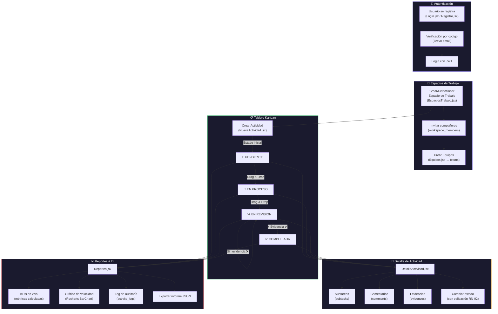

# Documento 2 — Modelo de Flujo de Proceso y Trazabilidad de Pantallas
## SchoolBoard (TaskBoard Académico)

> **Autor**: Dev
> **Proyecto**: SchoolBoard — Sistema de Gestión de Actividades Académicas (Equipo 5)
> **Fuente de verdad**: Código fuente del repositorio `CharlyLP04/SchoolBoard`

---

## 2. Modelo de Flujo / Proceso — Vista BI

### 2.1 Flujo Principal: Ciclo de Vida de una Actividad en el Sistema

### 2.2 Trazabilidad Pantalla ↔ Proceso ↔ Tabla BD

| Pantalla (`.jsx`) | Proceso/Acción | Tabla(s) BD involucrada(s) | Endpoint API |
|---|---|---|---|
| [`Login.jsx`](file:///c:/Users/col28/OneDrive/Desktop/SchoolBoard/src/pages/Login.jsx) | Autenticación | `users` | `POST /api/auth/login` |
| [`Registro.jsx`](file:///c:/Users/col28/OneDrive/Desktop/SchoolBoard/src/pages/Registro.jsx) | Registro con código | `users`, `registration_verifications` | `POST /api/auth/register-send-code`, `POST /api/auth/register` |
| [`RecuperarContrasena.jsx`](file:///c:/Users/col28/OneDrive/Desktop/SchoolBoard/src/pages/RecuperarContrasena.jsx) | Reset password | `users`, `password_reset_tokens` | `POST /api/auth/forgot-password` |
| [`EspaciosTrabajo.jsx`](file:///c:/Users/col28/OneDrive/Desktop/SchoolBoard/src/pages/EspaciosTrabajo.jsx) | CRUD de espacios | `workspaces`, `workspace_members` | `GET/POST /api/workspaces` |
| [`Equipos.jsx`](file:///c:/Users/col28/OneDrive/Desktop/SchoolBoard/src/pages/Equipos.jsx) | Gestión de equipos | `teams`, `team_members` | `GET/POST/DELETE /api/teams` |
| [`Tablero.jsx`](file:///c:/Users/col28/OneDrive/Desktop/SchoolBoard/src/pages/Tablero.jsx) | Board Kanban + Epics | `tasks` | `GET/POST/PUT/DELETE /api/tasks` |
| [`NuevaActividad.jsx`](file:///c:/Users/col28/OneDrive/Desktop/SchoolBoard/src/pages/NuevaActividad.jsx) | Crear actividad | `tasks`, `evidences` | `POST /api/tasks` |
| [`DetalleActividad.jsx`](file:///c:/Users/col28/OneDrive/Desktop/SchoolBoard/src/pages/DetalleActividad.jsx) | Ver/editar actividad | `tasks`, `subtasks`, `comments`, `evidences` | `PUT /api/tasks/:id`, `POST subtasks/comments/evidences` |
| [`Reportes.jsx`](file:///c:/Users/col28/OneDrive/Desktop/SchoolBoard/src/pages/Reportes.jsx) | Dashboard BI | `tasks` (en vivo), `activity_logs` | `GET /api/logs` |

