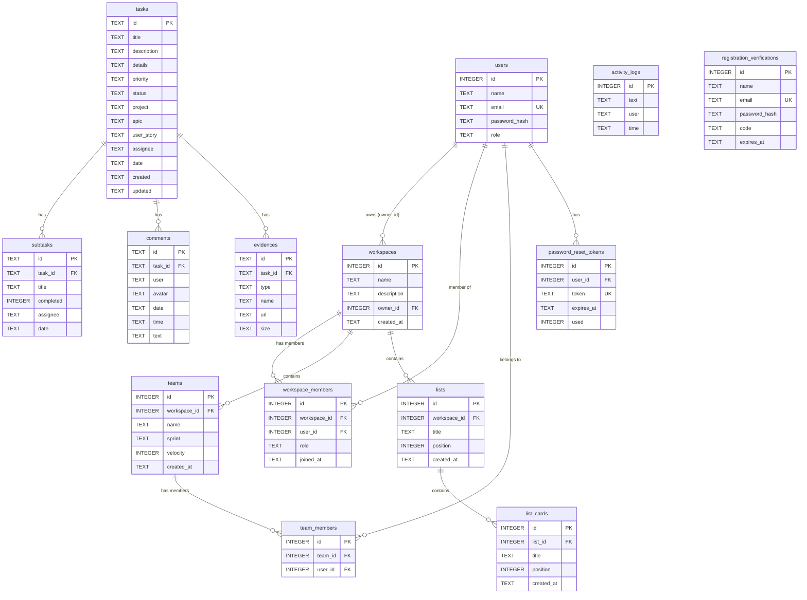

# Documento 3 — Modelo de Datos (Esquema Real de Base de Datos)
## SchoolBoard (TaskBoard Académico)

> **Autor**: Dev
> **Proyecto**: SchoolBoard — Sistema de Gestión de Actividades Académicas (Equipo 5)
> **Fuente de verdad**: Código fuente del repositorio `CharlyLP04/SchoolBoard`

---

## 3. Modelo de Datos — Esquema Real de Base de Datos

### 3.1 Motor y Ubicación

| Parámetro | Valor |
|---|---|
| **Motor** | SQLite 3 |
| **Driver Node.js** | `sqlite3` + `sqlite` (wrapper async) |
| **Ubicación** | [`server/schoolboard.db`](file:///c:/Users/col28/OneDrive/Desktop/SchoolBoard/server/schoolboard.db) |
| **Archivo de esquema** | [`server/db.js`](file:///c:/Users/col28/OneDrive/Desktop/SchoolBoard/server/db.js) |
| **Foreign Keys** | `PRAGMA foreign_keys = ON` |

### 3.2 Diagrama Entidad-Relación

### 3.3 Detalle de Tablas con Tipos y Constraints

#### Tabla `users`
| Columna | Tipo | Constraints | Notas |
|---|---|---|---|
| `id` | INTEGER | PK, AUTOINCREMENT | — |
| `name` | TEXT | NOT NULL | Nombre completo |
| `email` | TEXT | UNIQUE, NOT NULL | Identificador de login |
| `password_hash` | TEXT | NOT NULL | Hash bcrypt (salt 10) |
| `role` | TEXT | NOT NULL | Valores: `'admin'`, `'member'` |

#### Tabla `tasks`
| Columna | Tipo | Constraints | Notas |
|---|---|---|---|
| `id` | TEXT | PK | Formato: `t-{timestamp}` |
| `title` | TEXT | NOT NULL | — |
| `description` | TEXT | — | Descripción corta |
| `details` | TEXT | — | Detalles extendidos |
| `priority` | TEXT | NOT NULL | Valores: `'high'`, `'medium'`, `'low'` |
| `status` | TEXT | NOT NULL | Valores: `'pendiente'`, `'proceso'`, `'revision'`, `'completada'` |
| `project` | TEXT | NOT NULL | Nombre del espacio/proyecto asociado |
| `epic` | TEXT | — | ID del módulo/epic (ej. `EPIC-A12BC`) |
| `user_story` | TEXT | — | Historia de usuario asociada |
| `assignee` | TEXT | — | Nombre del responsable |
| `date` | TEXT | — | Fecha de vencimiento `YYYY-MM-DD` |
| `created` | TEXT | — | Timestamp de creación |
| `updated` | TEXT | — | Timestamp de última actualización |

#### Tabla `subtasks`
| Columna | Tipo | Constraints | Notas |
|---|---|---|---|
| `id` | TEXT | PK | Formato: `st-{timestamp}-{random}` |
| `task_id` | TEXT | FK → `tasks.id` ON DELETE CASCADE | — |
| `title` | TEXT | NOT NULL | — |
| `completed` | INTEGER | DEFAULT 0 | `0` = no, `1` = sí |
| `assignee` | TEXT | — | Responsable de la subtarea |
| `date` | TEXT | — | Fecha de vencimiento |

#### Tabla `comments`
| Columna | Tipo | Constraints | Notas |
|---|---|---|---|
| `id` | TEXT | PK | Formato: `c-{timestamp}-{random}` |
| `task_id` | TEXT | FK → `tasks.id` ON DELETE CASCADE | — |
| `user` | TEXT | NOT NULL | Nombre del autor |
| `avatar` | TEXT | NOT NULL | Iniciales del autor (ej. `"AP"`) |
| `date` | TEXT | NOT NULL | Fecha formateada (ej. `"19 ago"`) |
| `time` | TEXT | NOT NULL | Hora formateada |
| `text` | TEXT | NOT NULL | Contenido del comentario |

#### Tabla `evidences`
| Columna | Tipo | Constraints | Notas |
|---|---|---|---|
| `id` | TEXT | PK | Formato: `ev-{timestamp}-{random}` |
| `task_id` | TEXT | FK → `tasks.id` ON DELETE CASCADE | — |
| `type` | TEXT | NOT NULL | Valores: `'link'`, `'file'` |
| `name` | TEXT | NOT NULL | Nombre descriptivo del recurso |
| `url` | TEXT | — | URL del enlace (si type='link') |
| `size` | TEXT | — | Tamaño del archivo (si type='file') |

#### Tabla `workspaces`
| Columna | Tipo | Constraints | Notas |
|---|---|---|---|
| `id` | INTEGER | PK, AUTOINCREMENT | — |
| `name` | TEXT | NOT NULL | — |
| `description` | TEXT | — | — |
| `owner_id` | INTEGER | FK → `users.id` ON DELETE CASCADE | Creador del espacio |
| `created_at` | TEXT | NOT NULL | Timestamp ISO |

#### Tabla `workspace_members`
| Columna | Tipo | Constraints | Notas |
|---|---|---|---|
| `id` | INTEGER | PK, AUTOINCREMENT | — |
| `workspace_id` | INTEGER | FK → `workspaces.id` ON DELETE CASCADE | — |
| `user_id` | INTEGER | FK → `users.id` ON DELETE CASCADE | — |
| `role` | TEXT | DEFAULT `'member'` | Valores: `'admin'`, `'member'` |
| `joined_at` | TEXT | NOT NULL | Timestamp ISO |
| — | — | `UNIQUE(workspace_id, user_id)` | Evita duplicados |

#### Tabla `teams`
| Columna | Tipo | Constraints | Notas |
|---|---|---|---|
| `id` | INTEGER | PK, AUTOINCREMENT | — |
| `workspace_id` | INTEGER | FK → `workspaces.id` ON DELETE CASCADE | — |
| `name` | TEXT | NOT NULL | — |
| `sprint` | TEXT | — | Nombre/número del sprint actual |
| `velocity` | INTEGER | — | Puntos de velocidad |
| `created_at` | TEXT | NOT NULL | Timestamp ISO |

#### Tabla `team_members`
| Columna | Tipo | Constraints | Notas |
|---|---|---|---|
| `id` | INTEGER | PK, AUTOINCREMENT | — |
| `team_id` | INTEGER | FK → `teams.id` ON DELETE CASCADE | — |
| `user_id` | INTEGER | FK → `users.id` ON DELETE CASCADE | — |
| — | — | `UNIQUE(team_id, user_id)` | Evita duplicados |

#### Tabla `lists` (HU-19/HU-20)
| Columna | Tipo | Constraints | Notas |
|---|---|---|---|
| `id` | INTEGER | PK, AUTOINCREMENT | — |
| `workspace_id` | INTEGER | FK → `workspaces.id` ON DELETE CASCADE | — |
| `title` | TEXT | NOT NULL | — |
| `position` | INTEGER | DEFAULT 0 | Orden de visualización |
| `created_at` | TEXT | NOT NULL | — |

#### Tabla `list_cards`
| Columna | Tipo | Constraints | Notas |
|---|---|---|---|
| `id` | INTEGER | PK, AUTOINCREMENT | — |
| `list_id` | INTEGER | FK → `lists.id` ON DELETE CASCADE | — |
| `title` | TEXT | NOT NULL | — |
| `position` | INTEGER | DEFAULT 0 | Orden dentro de la lista |
| `created_at` | TEXT | NOT NULL | — |

#### Tabla `activity_logs`
| Columna | Tipo | Constraints | Notas |
|---|---|---|---|
| `id` | INTEGER | PK, AUTOINCREMENT | — |
| `text` | TEXT | NOT NULL | Descripción de la acción realizada |
| `user` | TEXT | NOT NULL | Nombre del usuario que realizó la acción |
| `time` | TEXT | NOT NULL | Timestamp formateado (ej. `"Hoy · 19 ago 10:30"`) |

#### Tabla `password_reset_tokens` (HU-16)
| Columna | Tipo | Constraints | Notas |
|---|---|---|---|
| `id` | INTEGER | PK, AUTOINCREMENT | — |
| `user_id` | INTEGER | FK → `users.id` ON DELETE CASCADE | — |
| `token` | TEXT | UNIQUE, NOT NULL | Token crypto seguro |
| `expires_at` | TEXT | NOT NULL | Expiración ISO |
| `used` | INTEGER | DEFAULT 0 | `0` = no usado, `1` = ya usado |

#### Tabla `registration_verifications`
| Columna | Tipo | Constraints | Notas |
|---|---|---|---|
| `id` | INTEGER | PK, AUTOINCREMENT | — |
| `name` | TEXT | NOT NULL | — |
| `email` | TEXT | UNIQUE, NOT NULL | — |
| `password_hash` | TEXT | NOT NULL | Hash bcrypt pre-registro |
| `code` | TEXT | NOT NULL | Código de 6 dígitos |
| `expires_at` | TEXT | NOT NULL | Expiración a 15 minutos |

### 3.3.1 Evidencia de código — `server/db.js` completo

Captura íntegra del archivo de esquema, dividida en 6 tramos para lectura, que respalda todas las tablas descritas en 3.2 y 3.3:

**Tramo 1 — `users`, inicio de `tasks`:**

**Tramo 2 — fin de `tasks`, `subtasks`:**

**Tramo 3 — `comments`, `evidences`, `workspaces`:**

**Tramo 4 — `workspace_members`, `teams`:**

**Tramo 5 — `team_members`, `lists`, `list_cards`:**

**Tramo 6 — `password_reset_tokens`, `activity_logs`, `registration_verifications`:**

### 3.4 Datos Semilla (Seed)

| Tabla | Registro | Valores |
|---|---|---|
| `users` | Admin por defecto | `name`: Administrador, `email`: admin@schoolboard.com, `password`: admin123, `role`: admin |

> [!NOTE]
> El sistema inicia **sin tareas, comentarios ni evidencias precargadas**. Los datos de prueba de velocidad en el gráfico son datos mock locales en [`mockData.js`](file:///c:/Users/col28/OneDrive/Desktop/SchoolBoard/src/data/mockData.js).

