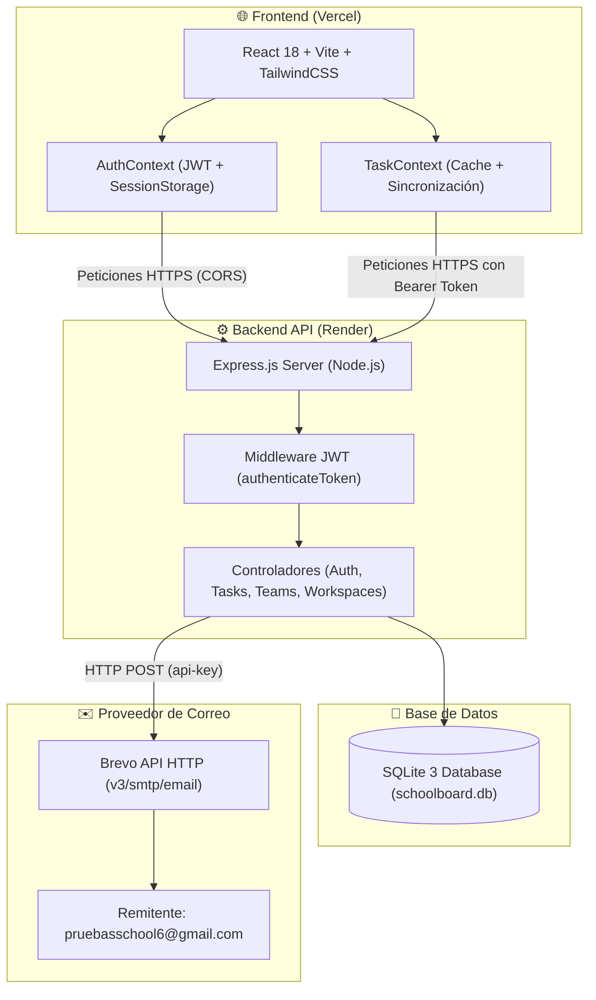
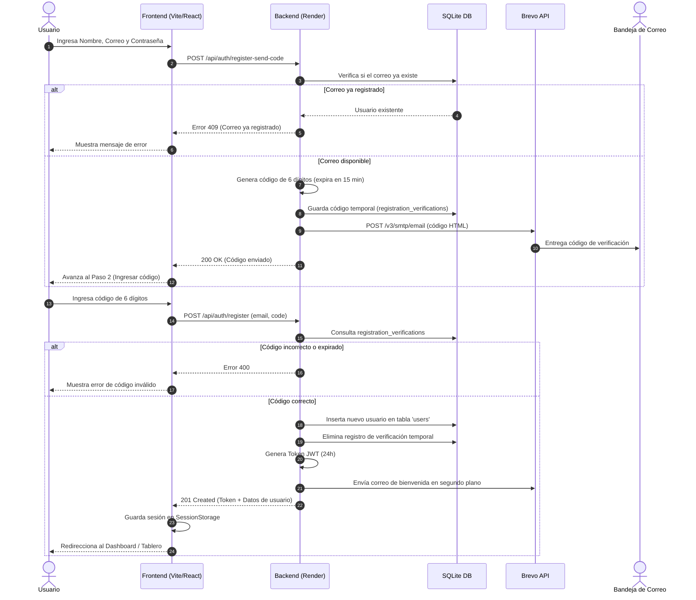
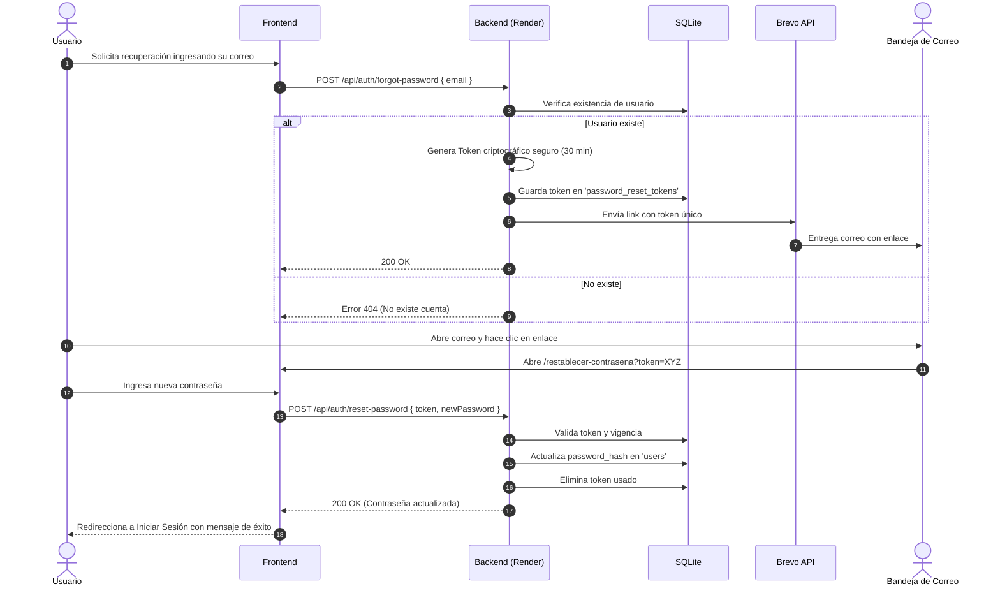
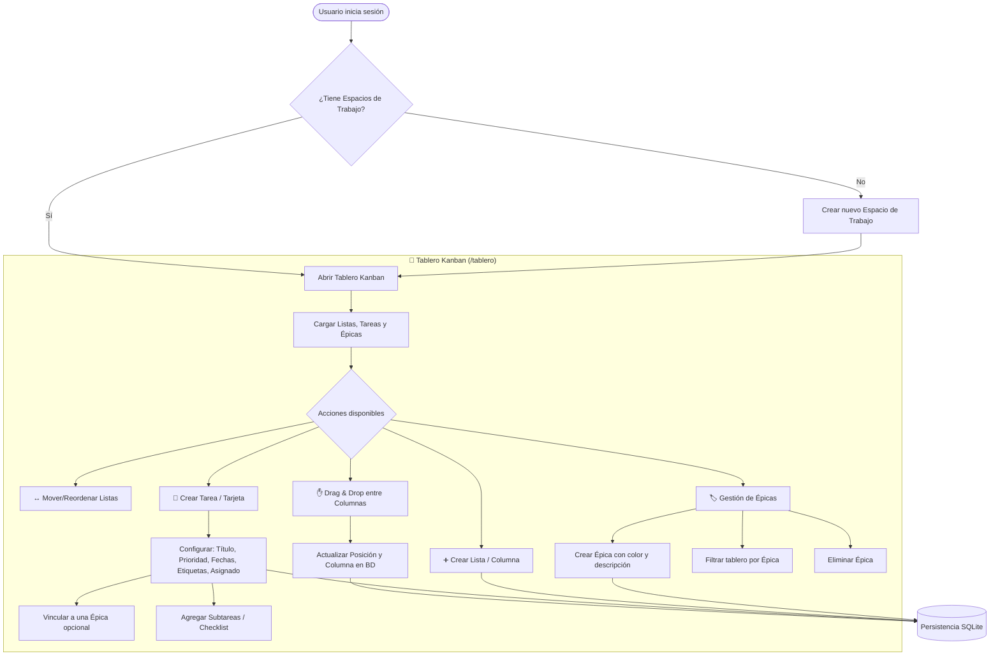
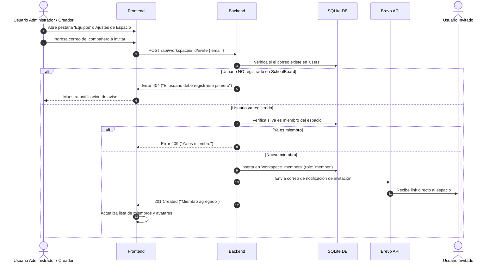
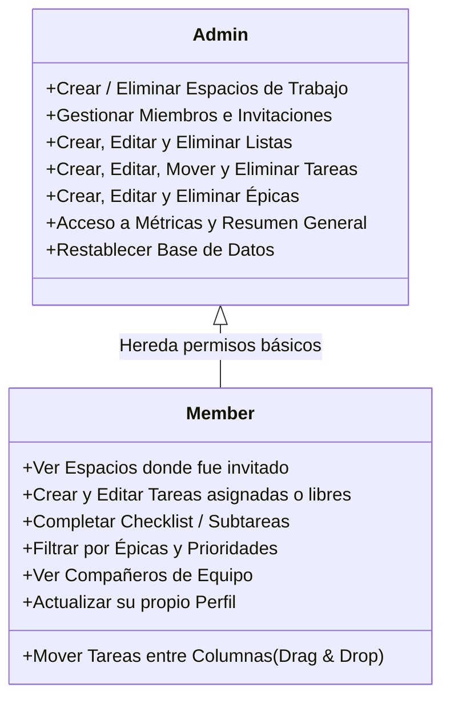
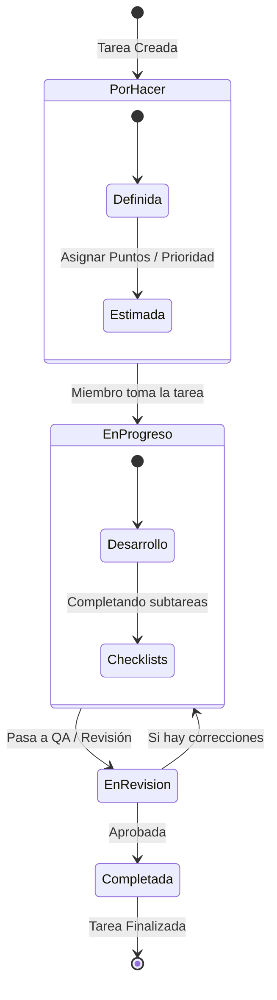

# 📊 SchoolBoard - Diagramas de Flujo, Arquitectura y Funcionamiento

Documento técnico y visual del funcionamiento integral del sistema **SchoolBoard**, que abarca arquitectura, flujos de autenticación, gestión de tareas/épicas, invitaciones por correo y módulos de colaboración.

---

## 🏛️ 1. Arquitectura General del Sistema

El sistema utiliza una arquitectura cliente-servidor desacoplada con comunicación REST y servicios en la nube:

---

## 🔐 2. Flujo de Autenticación y Registro (HU-01, HU-02)

Flujo de verificación en dos pasos para garantizar correos válidos mediante **Brevo**:

---

## 🔑 3. Flujo de Recuperación de Contraseña (HU-03)

---

## 📋 4. Flujo de Gestión de Tablero, Épicas y Tareas (HU-05 a HU-17)

---

## 👥 5. Flujo de Equipos y Colaboración (HU-18)

Manejo de equipos de trabajo y asignación de colaboradores:

---

## 🛡️ 6. Matriz de Permisos y Roles

---

## 🔄 7. Ciclo de Vida de una Tarea (Sprint / Flujo Ágil)

---

## 📁 8. Resumen de Tecnologías y Servicios

| Componente | Tecnología | Proveedor / Entorno |
| :--- | :--- | :--- |
| **Frontend** | React 18, Vite, Tailwind CSS, Lucide Icons, Recharts | Vercel |
| **Backend API** | Node.js, Express.js, JWT, bcryptjs | Render (`onrender.com`) |
| **Base de Datos** | SQLite 3 (`sqlite3` / `sqlite`) | Render Disk / Servidor |
| **Envío de Correos** | Brevo API HTTP (Transaccional v3) | Remitente Gmail verificado |
| **Seguridad** | JWT Bearer Tokens (24h expiración) | SHA-256 / HMAC |
